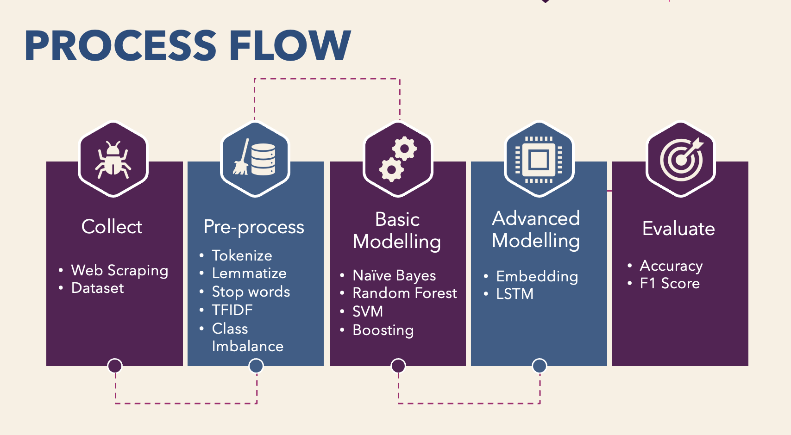
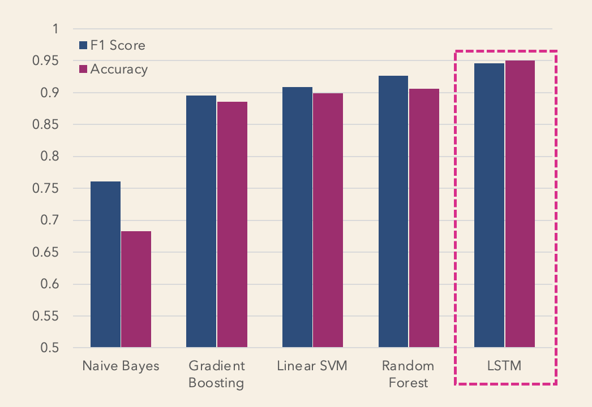

# CraigList-Job-Scam-Detection
In this project, We have explored natural language processing and machine learning techniques to automate detection of fradulent jobs.

## Process Flow:

## Data Sources:

1. Scraped listings from the Craigslist jobs section, then manually labelled the data depending on whether the job listing is authentic or fake/scam.
2. Enriched the dataset using third-party data. Specifically, we use EMSCAD - Employment Scam Aegean Dataset (http://emscad.samos.aegean.gr/), which is a labeled data set for job scams.

## Results:

LSTM performed the best with an F1 score of 0.94 while the Naive Bayes performed the worst with an F1 score of 0.81.

